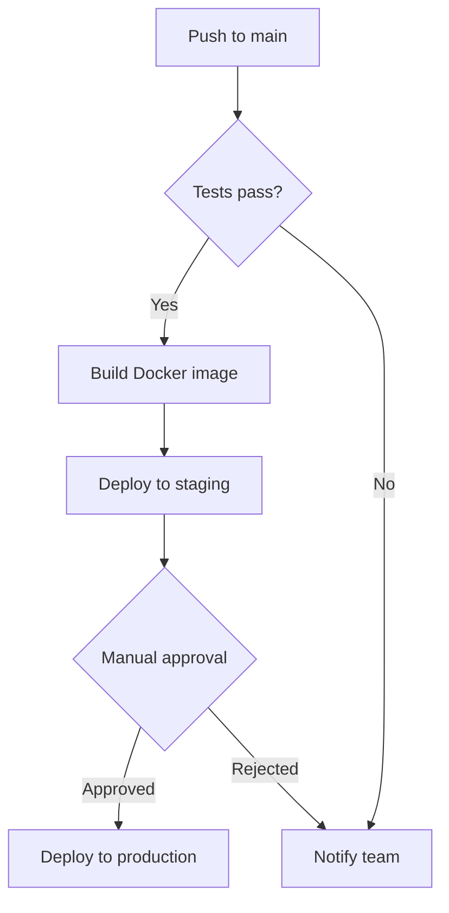
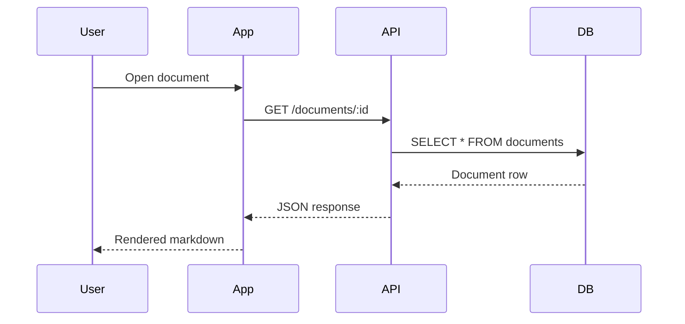
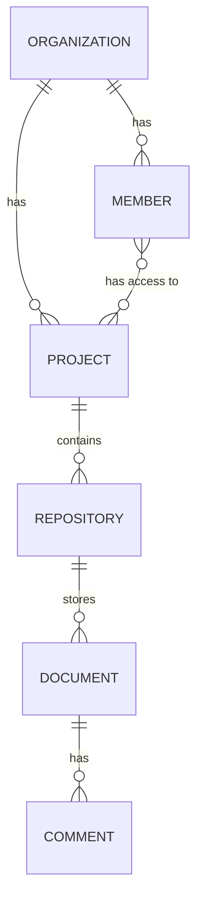
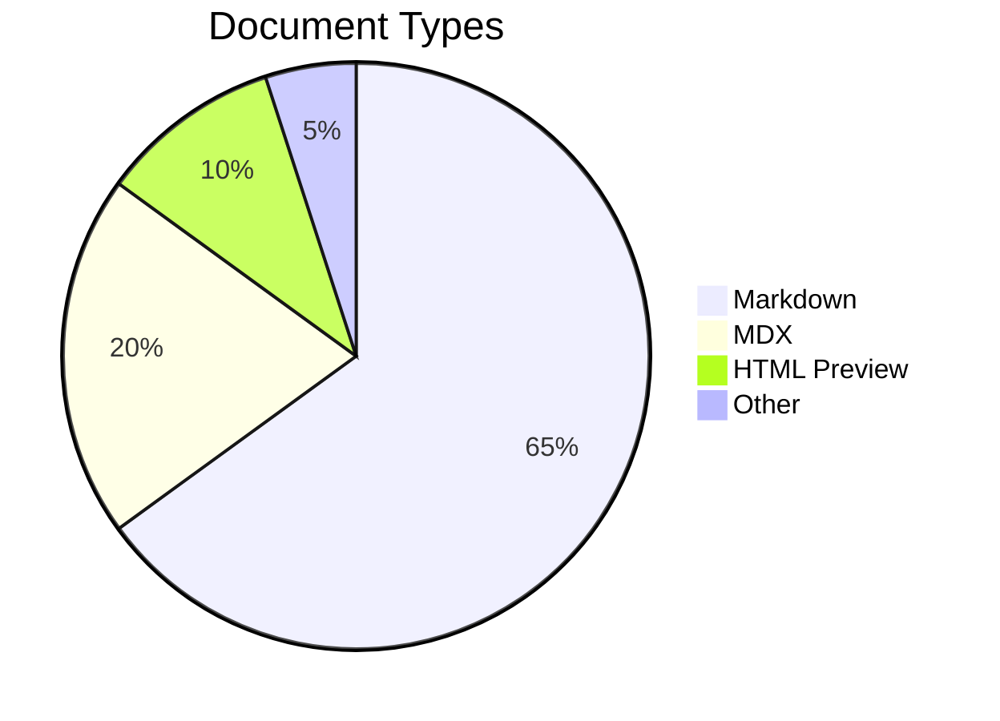
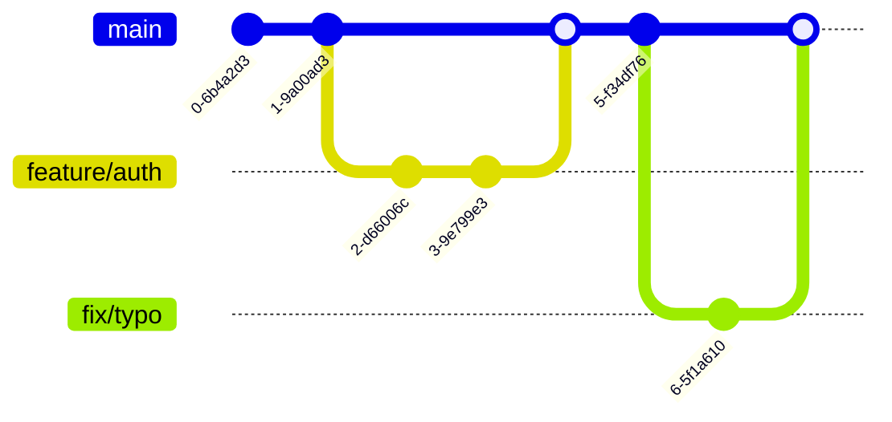

# Mermaid Diagrams

Andocs renders Mermaid diagrams automatically from ` ```mermaid ` code blocks. Diagrams support zoom, pan, and fullscreen view.

## Flowchart



## Sequence Diagram



## Entity-Relationship Diagram



## Pie Chart



## Git Graph



## Tips

- Diagrams auto-detect dark/light theme
- Use the fullscreen button for complex diagrams
- Zoom in/out with the controls that appear on hover
